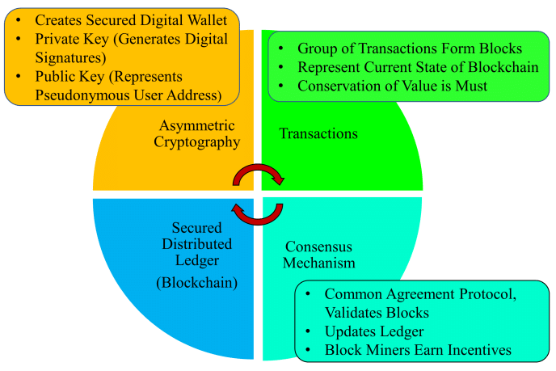

## Welcome to week 1 

___ 

#### 1. Bitcoin and Blockchain

\- **Definition of Blockchain:** peer to peer transaction in a decentralized network. These below characteristics help Blockchain ensure **Trust** and **Security**: 

+ Immutable Distributed Ledger of records of transactions

+ Validate, Verify and Consensus

\- Some papers and websites for better understanding of fundamental Blockchain concept:

+ [Bitcoin paper - Author: Satoshi Nakamoto](https://bitcoin.org/bitcoin.pdf)

+ [The concept of cryptocurrencies is built from forgotten ideas in research literature - Author: Arvind Narayanan and Jeremy Clark](https://queue.acm.org/detail.cfm?id=3136559)

#### 2. Blockchain structure

\- Many **transactions** form a **block**, many **blocks** form a **chain**, **blocks** go through the **consensus mechanism** to select the **next block** that will be added to the chain. 

+ **A Genesis Block** is the name given to the first block a cryptocurrency

| |
|:--:| 
| *Fig 1. The structure of blockchain* |

\- **Validation** and **consensus** process are carried out by **miners**.

\- I have pictured 2 real blocks on [blockchain.info](https://www.blockchain.com/explorer) to see Bitcoin block and transaction structures. 

|  |  |
:-------------------------:|:-------------------------:
| *Fig 2. The components of previous block* | *Fig 3. The components of current block* |

\- [**Unspent Transaction Outputs (UTXO):**](https://river.com/learn/terms/u/unspent-transaction-output-utxo/) a list of *unspent* Bitcoin amounts that have been sent to a user.

#### 3. Basic operations

\- Main operations: 

+ Validation of transactions

+ Gathering transactions for a block

+ Broadcasting valid transactions & blocks 

+ Using consensus mechanism for adding next block 

+ Chaining the block

\- Participants : 

+ Users: initiating transactions 

+ Miners: 

    - Verify transactions

    - Broadcast transactions

    - Compete to create a block 

    - Reach consensus by validating block to add the block

    - Broadcast new block

    - Confirm transactions 

    - Finally, miners will get incentives 

|  |
:---:
|*Fig 4. How bitcoin transactions work*|

\- Actually, after writing a bunch of theory, I am quite vague about how operations work. Then, I have had read this article [how-bitcoin-transactions-work](https://www.bitcoin.com/get-started/how-bitcoin-transactions-work/) and found it concise to gain more understanding above concepts and procedures. So, I highly recommend you read it. 

#### 4. Beyond bitcoin

\- Three types of Blockchain: 

+ Only cryptocurrency: For example, Bitcoin,...

+ Currency and business logic: For example, Ethereum,..

+ Only business logic: For example, Hyperledger

\- Blockchain categories: 

+ ***Public blockchain:*** 

    + Open, decentralized networks of computers

    + Use PoW and PoS consensus mechanisms 

    + For example: Bitcoin, Ethereum,...

+ ***Private blockchain:***

    + Have access restrictions (governed by an organization, a company,...) and be centralized

    + For example: Private Ethereum,...
    
+ ***Consortium blockchains:***

    + A consortium is a special type of blockchain where multiple individuals or organizations govern the blockchain network.
    
    + For example: Hyperledge Fabric,...
    
+ ***Hybrid blockchain:***

    + Combination of public and private blockchain

+ ***Sidechains:***

    + Running parallel to the main chain. 
