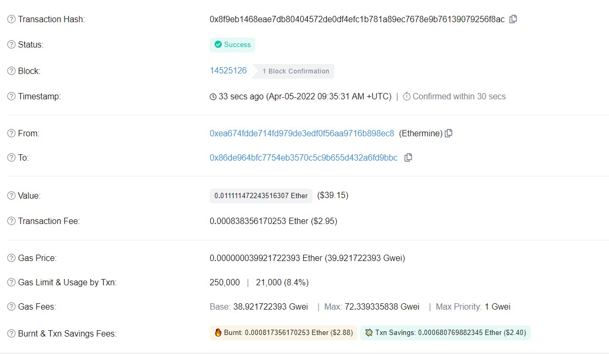

## Welcome to week 2

___ 

#### 1. Smart contracts 

\- **Definition:** `smart contract` is a piece of code deployed in blockchain nodes. 

+ It helps creating logic conditions or agreements approved by organizations.

||
:---:
|*Fig 1. Difference between Bitcoin and Ethereum stack* |

\- At this step, I think we should temporarily understand **smart contract** in this simple way. We will read more about it later instead of read extra resources mentioned in this part right now because it relates to Ethereum in the next section. 

#### 2. Ethereum

\- Well, It is a great time to read [**Ethereum homepage**](https://ethdocs.org/en/latest/introduction/what-is-ethereum.html) to have a overview about [**smart contract**](https://docs.soliditylang.org/en/develop/introduction-to-smart-contracts.html) and **Ethereum stuff**. 

##### 2.1. Transactions 

\- An EOA will initiate a transaction to update *the state* of the Ethereum network. 

||
:---:
|*Fig 2. A Transaction between two individuals*|

\- Transactions require *a fee* (or gas, we will discover later) and must be mined to become valid.

##### 2.2. Accounts 

\- **The account** is the sender and the receiver of a transaction that updates **balance** as opposed to **UTXO** methods in Bitcoin. An Ethereum account contains four fields:

+ **Nonce:** a counter used to make sure each transaction can only be processed once

+ **Ether balance**

+ **Contract code** (if present)

+ **Storage** (empty by default)

\- **Two types of accounts:**

+ `Externally Owned Accounts (EOAs)` which are controlled by private keys. The address of an account is determined from the public key.

+ `Contract Accounts (CA)` which are controlled by their contract code and can only be “activated” by an EOA

    + The address of a contract is determined at the time the contract is created (it is derived from the creator address and the number of transactions sent from that address, the so-called `nonce`).

\- Like Bitcoin users must pay small transaction fees to the network. 

+ Fees are paid in **Wei**: 1 Ether = $10^{18}$ Wei

+ **Ether:** Ethereum’s token, which is required to make transactions and execute smart contracts on Ethereum.

    + when it’s used to execute smart contacts on the network it’s often referred to as [**gas**](https://ethereum.stackexchange.com/questions/3/what-is-meant-by-the-term-gas). 

\- For more details, we can examine a transaction taken from [https://etherscan.io](https://etherscan.io/tx/0x8f9eb1468eae7db80404572de0df4efc1b781a89ec7678e9b76139079256f8ac) to see components of a transaction and read **Ethereum white paper** in the *Reading_materials folder* of this week.

| |
:---:
|*Fig 3. An Ethereum transaction*|

+ **Ethereum difficulty** is a measure of *how many hashes* (statistically) must be generated to find a valid solution to solve the next Ethereum block and earn the mining reward.
##### 2.3. Ethereum Virtual Machine (EVM)

\- EVM allows developers to create smart contracts and lets nodes seamlessly interact with them.

\- Convert high-level programming language into **opcodes**

##### 2.4. An Ethereum full node

\- They hold softwares (including EVM,..) needed for:

+ Transaction initiation 

+ Transaction validation: checking time-stamp, the nonce, sufficient fees.

+ Mining 

+ Block creation 

#### 3. Ethereum operations

\- **Consensus mechanism:** *Ethereum 2.0*  the entire network migrate from a proof-of-work to a **proof-of-stake blockchain (PoS)**. [From coindesk.com](https://www.coindesk.com/learn/how-does-ethereum-work/)

+ **Proof-of-Stake:** Instead of requiring mining nodes to run expensive equipment like **PoW** to discover new blocks, the new PoS system requires users to deposit and lock a specific of coins on the network. 

+ **Stake** means how many coins they hold.

\- When a person sends a transaction to a smart contract deployed on Ethereum, every node runs the smart contract and the transaction through their own EVM. 

+ Input for this execution is extracted from ***payload*** of transaction.

#### 4. Incentive model

\- Mining process computes ***gas points*** required for execution of a transaction.

+ **Gas limit:** the amount of gas points available 

+ **Gas spent:** actual amount spent at completion of block creation.

+ **Gas price:** the fee that sender is willing to pay for the computations. 

+ **maxPriorityFeePerGas** - the maximum amount of gas to be included as a tip to the miner.

\- These miners will solve the puzzle, but didn't win the block are called **Ommers** 

+ Ommer miners also get a small percentage of the total gas points as a consolation and for network security.