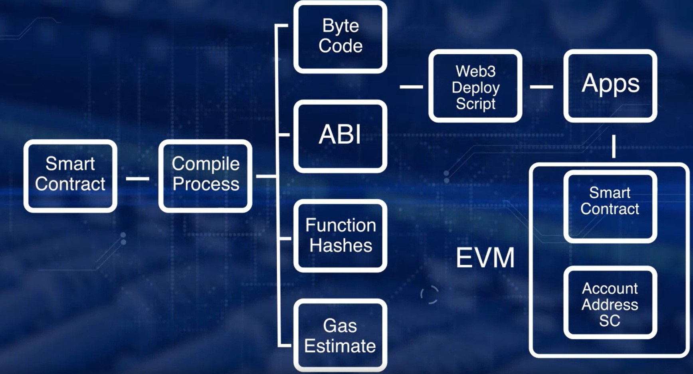

## Welcome to week 1

___

#### 1. Why smart contracts ?

\- Bitcoin has a **script feature** including rules and policies.

\- Ethereum introduces smart contract layer 

+ It facilitates the transaction for transfer of assets other than cryptocurrency.

+ Implementation of flexible rules, business logics and programming languages.

||
:---:
|*Fig 1. The Ethereum architecture*|

#### 2. Smart contract defined 

\- Smart contract inherits characteristics of the Blockchain, so when code is deployed, it will be immutable. If we want to change anything in it, we need to redeploy.

\- In this lecture, we will use Solidity and Remix Ethereum environment to deploy smart contracts. 

#### 3. Processing smart contracts

\- We need **an address** that is computed by *hashing the account number of EOA and Nonce* for the smart contract to deploy it and invoke its functions.

\- We we compile a smart contract on Remix, we will have some important artifacts like: 

||
:---:
|*Fig 2. Remix's compile artifacts*|

#### 4. Account Types, Gas, and Transactions

\- Before, we go to learn further lessons, I think we should read several concepts relating to [**Account Types, gas and Transactions**](https://ethdocs.org/en/latest/contracts-and-transactions/account-types-gas-and-transactions.html) again.

##### 4.1. EOA and Contract Accounts (CA)

| **EOA** | **Contract accounts**| 
|---|---|
| Has an ether balance | Has an ether balance|
| Is controlled by private key | Is controlled by EOAs | 
| Can send transactions | Is triggered by transactions or messages (calls) received from other contracts. | 
| Has no associated code | Has associated code | 

\- If the destination of the transaction is another EOA, then the transaction may transfer some ether but otherwise does nothing. However, if the destination is a contract, then the contract in turn activates, and automatically runs its code.

\- The contract code is executed by the **Ethereum Virtual Machine** on each node participating in the network as part of their verification of new blocks.

||
:---:
|*Fig 3. Ethereum transaction workflow*|

##### 4.2. Transaction

\- **Transaction** is the **signed package** that store a message to be sent from an EOA to another account.

\- A transaction contains: 

+ The recipient of the message (address)

+ Sender's signature

+ `VALUE` field: The amount of wei to transfer from the sender to the recipient

+ `STARTGAS` value: the maximum number of computational steps the transaction execution is allowed to take

+ `GASPRICE` value: the fee the sender is willing to pay for gas

##### 4.3. Message

\- Contracts have the ability to send **message** that exist only in the Ethereum execution environment to other contracts.

+ A message is produced when a contract executes the `CALL` or `DELEGATECALL` opcodes

\- A message contains: 

+ The sender of the message (function calls)

+ The recipient of the message

+ `VALUE` field: is similar to **transaction**

+ `STARTGAS` value

##### 4.4. Gas

\- For every executed operation when a contract is executed, there is a specified cost, named **gas units**.

\- The total ether cost of a transaction is based on 2 factors: 

+ `gasUsed` is the total gas that is consumed by the transaction

+ `gasPrice` (in ether) price of one unit of gas specified in the transaction. By default, gasPrice has the value of 0.05e12 wei.

> **Total cost = gasUsed x gasPrice**

\- This picture below shows gas cost of some operations, we can consider, it is just for reference only: 

||
:---:
|*Fig 4. Gas cost of Ethereum operations*|

##### 5. Deploying smart contracts

\- Steps of deploying a smart contract: 

+ First, a smart contract solution is written in high-level language and compiled to bytecode. An ABI is also generated for high-level language application (For example, Web Apps to interact with the binary smart contract).

+ EVM provides execution environment for a smart contract bytecode.

+ The **contract address** is generated by hashing the ***sender's account address*** and ***its nonce***.

||
:---:
|*Fig 5. The process of deployment of remix IDE *|