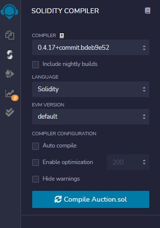

## Welcome to week 4

___

#### 1. Best practices: Evaluating Smart Contracts

\- Blockchain is most suitable for: 

+ Decentralized problems 

+ Peer-to-peer transactions

+ Trust among unknown peers

+ Require validation, verification, and recording on a universally timestamped, immutable ledger.

+ Autonomous operations guided by rules and policies.

#### 2. Final Course Project

\- **NOTES:**

+ Using the compiler version at 0.4.17 on Remix IDE

||
:---:
|*Fig 1. Modify the Solidity's compiler on Remix IDE*|

\- To summary, in this project, we have information as follows:

+ Fund rasing for a cause by auctioning **items** that has ***IDs*** and ***tokens***

+ **Bidders**: ID, tokens and need to ***self-register***.

+ **Chairperson**: randomly selects a ticket from each item’s bowl to determine the winning bidder for that item.

+ Assumptions to make the problem simple:

    + Fixed number of bidders: 4

    + Fixed number of items: 3

    + Each bidder has 5 tokens
