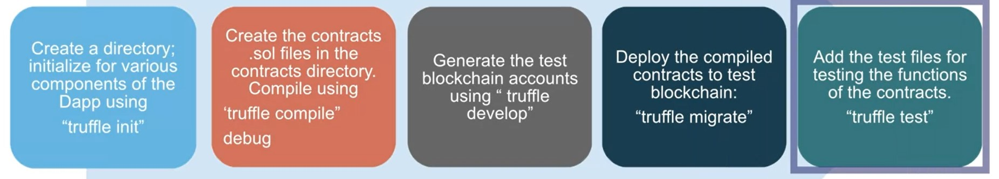
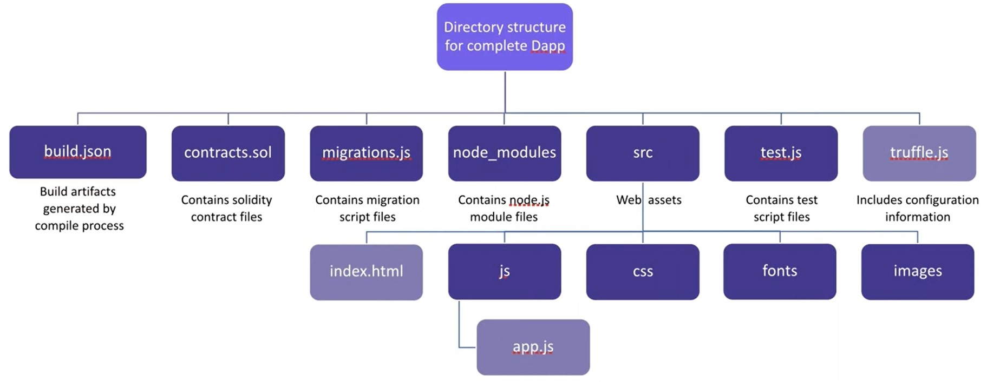

## Welcome to week 2

___

#### 1. Truffle development

\- In this module, we will develop a Dapp using Truffle IDE. All code and configure files are put into **/src** folder.

||
:---:
|*Fig 1. Steps for developing a Dapp using Truffle*|

\- To conduct building a Dapp, we first need to reuse the VM in the course 1. Besides, because truffle package in this VM is outdated, we need to install a newer package. 

```bash
ubuntu@ubuntu-vbox:~$ sudo npm install -g truffle@4.1.15
ubuntu@ubuntu-vbox:~$ sudo cp ./.npm-global/bin/truffle /usr/bin/truffle
ubuntu@ubuntu-vbox:~$ truffle version
Truffle v4.1.15 (core: 4.1.15)
Solidity v0.4.25 (solc-js)
```

\- Well, it is time to use truffle for creating necessary components for our Dapp including **truffle-config.js**, **contracts**, **migrations** and **test**.

```shell
ubuntu@ubuntu-vbox:~$ mkdir ballotProject
ubuntu@ubuntu-vbox:~$ cd ballotProject/
ubuntu@ubuntu-vbox:~/ballotProject$ truffle init
Downloading...
Unpacking...
Setting up...
Unbox successful. Sweet!

Commands:

  Compile:        truffle compile
  Migrate:        truffle migrate
  Test contracts: truffle test
ubuntu@ubuntu-vbox:~/ballotProject$ ls
contracts  migrations  test  truffle-config.js
ubuntu@ubuntu-vbox:~/ballotProject$ 
```

\- Next, we need to copy pre-written smart contract, named **Ballot.sol**, to **contracts** folder and start compiling contracts.

```shell
ubuntu@ubuntu-vbox:~/ballotProject$ cp ../CourseraDocs/Ballot.sol contracts/
ubuntu@ubuntu-vbox:~/ballotProject$ cd contracts/
ubuntu@ubuntu-vbox:~/ballotProject/contracts$ ls
Ballot.sol  Migrations.sol
ubuntu@ubuntu-vbox:~/ballotProject$ truffle compile
Compiling ./contracts/Ballot.sol...
Compiling ./contracts/Migrations.sol...
Writing artifacts to ./build/contracts
ubuntu@ubuntu-vbox:~/ballotProject$ ls
build  contracts  migrations  test  truffle-config.js
```

\- We will to create a test network before deploying our smart contracts by using `truffle develop` on other terminal, we will have 10 fake accounts with their private keys: 

```shell
ubuntu@ubuntu-vbox:~/ballotProject$ ls
build  contracts  migrations  test  truffle-config.js  truffle.js
ubuntu@ubuntu-vbox:~/ballotProject$ more truffle.js 
module.exports = {
  // See <http://truffleframework.com/docs/advanced/configuration>
  // to customize your Truffle configuration!
  networks: {
    development: {
      host: "localhost",
      port: 9545, // for RPC port
      network_id: "*" // Match any network id
    }
  }
};
ubuntu@ubuntu-vbox:~/ballotProject$ truffle develop
Truffle Develop started at http://127.0.0.1:9545/

Accounts:
(0) 0x627306090abab3a6e1400e9345bc60c78a8bef57
(1) 0xf17f52151ebef6c7334fad080c5704d77216b732
(2) 0xc5fdf4076b8f3a5357c5e395ab970b5b54098fef
(3) 0x821aea9a577a9b44299b9c15c88cf3087f3b5544
(4) 0x0d1d4e623d10f9fba5db95830f7d3839406c6af2
(5) 0x2932b7a2355d6fecc4b5c0b6bd44cc31df247a2e
(6) 0x2191ef87e392377ec08e7c08eb105ef5448eced5
(7) 0x0f4f2ac550a1b4e2280d04c21cea7ebd822934b5
(8) 0x6330a553fc93768f612722bb8c2ec78ac90b3bbc
(9) 0x5aeda56215b167893e80b4fe645ba6d5bab767de

Private Keys:
(0) c87509a1c067bbde78beb793e6fa76530b6382a4c0241e5e4a9ec0a0f44dc0d3
(1) ae6ae8e5ccbfb04590405997ee2d52d2b330726137b875053c36d94e974d162f
(2) 0dbbe8e4ae425a6d2687f1a7e3ba17bc98c673636790f1b8ad91193c05875ef1
(3) c88b703fb08cbea894b6aeff5a544fb92e78a18e19814cd85da83b71f772aa6c
(4) 388c684f0ba1ef5017716adb5d21a053ea8e90277d0868337519f97bede61418
(5) 659cbb0e2411a44db63778987b1e22153c086a95eb6b18bdf89de078917abc63
(6) 82d052c865f5763aad42add438569276c00d3d88a2d062d36b2bae914d58b8c8
(7) aa3680d5d48a8283413f7a108367c7299ca73f553735860a87b08f39395618b7
(8) 0f62d96d6675f32685bbdb8ac13cda7c23436f63efbb9d07700d8669ff12b7c4
(9) 8d5366123cb560bb606379f90a0bfd4769eecc0557f1b362dcae9012b548b1e5

Mnemonic: candy maple cake sugar pudding cream honey rich smooth crumble sweet treat

⚠️  Important ⚠️  : This mnemonic was created for you by Truffle. It is not secure.
Ensure you do not use it on production blockchains, or else you risk losing funds.

truffle(develop)> 
```

\- After that, we can deploy our contracts to this test network: 

```shell
ubuntu@ubuntu-vbox:~/ballotProject$ truffle migrate --reset
Compiling ./contracts/Ballot.sol...
Writing artifacts to ./build/contracts

Using network 'development'.

Running migration: 1_initial_migration.js
  Deploying Migrations...
  ... 0xcee0f6047428143b8f7cf0810f9b6abaf25b52e7a04ca476220a319262cda099
  Migrations: 0x8cdaf0cd259887258bc13a92c0a6da92698644c0
Saving artifacts...
Running migration: 2_deploy_contracts.js
  Deploying Ballot...
  ... 0xc4274bc498e3da19e8920de7a169fb2e96bd35bcf544ba704bfb396b829f7c3d
  Ballot: 0xf12b5dd4ead5f743c6baa640b0216200e89b60da
Saving artifacts...
```

#### 2. Test-driven development

\- To check smart contract working smoothly, we need to create some positive and negative tests: 

```shell
ubuntu@ubuntu-vbox:~/ballotProject/test$ cp ../../CourseraDocs/test.js .
ubuntu@ubuntu-vbox:~/ballotProject/test$ ls
test.js
ubuntu@ubuntu-vbox:~/ballotProject/test$ cd ..
ubuntu@ubuntu-vbox:~/ballotProject$ truffle test
Using network 'development'.
  Contract: Ballot Contract
    ✓ Contract deployment
    ✓ Valid user registration (185ms)
    ✓ Valid voting (319ms)
    ✓ Validate winner (54ms)
    ✓ Should NOT accept unauthorized registration (38ms)
    ✓ Should NOT accept unregistered user vote (45ms)


  6 passing (701ms)

ubuntu@ubuntu-vbox:~/ballotProject$ gedit ./test/test.js
```

#### 3. Web Interface and Testing

\- In this module, we will create the frontend for our Dapp. So, we will have an standard Dapp structure.

||
:---:
|*Fig 2. Dapp structure*|

\- [**Metamask**](https://metamask.io/) is a digital wallet who helps connect Frontend and Blockchain server (sign transactions, manage accounts,...)

||
:---:
|*Fig 3. Metamask in Dapp architecture [1]*|

## References

+ - [1. https://codluck.com/the-architecture-of-a-web-3-0-application-dapps/](https://codluck.com/the-architecture-of-a-web-3-0-application-dapps/)