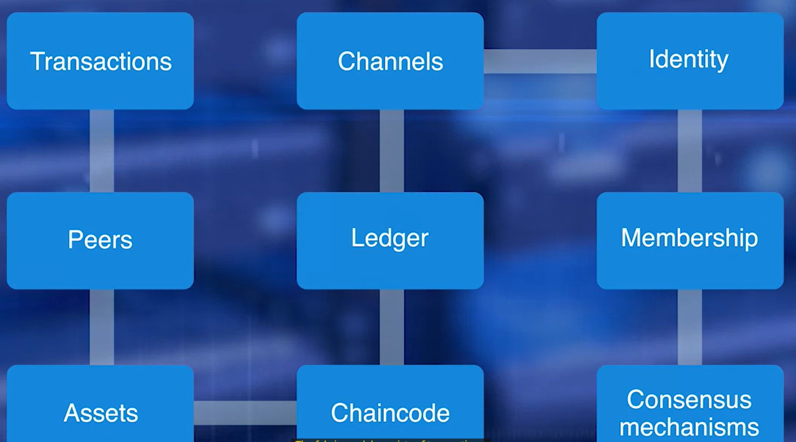

### Permissioned Blockchain

___

**Recall**

> **Permissioned Blockchain:** is not publicly accessible - defines the way participants are going to interact with the blockchain network [1]. It can only be accessed by users with ***permissions***. 

##### 1. Hyperledger

\- **Hyperledger fabric** is a permissioned blockchain.

##### 2. Fabric services

||
|:---:|
|*Figure 1. Hyperledger Fabric services*|

\- **Identity services:** manages the identity of participants, ledger objects like smart contract (chaincode).

\- **Policy services:** manages access controls, policies,...

\- **Blockchain services:** manages peer-to-peer communication protocols, consensus mechanism, and distributed ledger.

\- **Smart contract (or chaincode) services:** provides environments and functions to run.

##### 3. Fabric model and functions 

||
|:---:|
|*Figure 2. Hyperledger Fabric model*|

\- **Transaction**

\- **Peers**: initiate transactions and maintain the state of the ledger.

+ ***Endorsers***: receive, validate, sign and return transactions to applications.

+ ***Ordering service peers***: collect signed transactions and ordered them into blocks. Then, these peers send them to *committing peers*.

+ ***Committing peers***: receive blocks created by *ordering service peers*. These peers validate conditions like double spending, signature and then *commit them to the ledger*.

\- ***Assets***: tangible items such as financial assets, food supplies,...

\- ***Chaincode***: or (smart contract) defines rules, policies, functions. 

\- ***Ledger***

\- ***Channels***: enable *multi-lateral* transactions with

+ Single permissioned network with a single ledger.

+ Ensure privacy and confidentiality. 

\- ***Membership***: members want to join Fabric network need to enroll through *Membership Service Provider* (MSP).

\- ***Identity***: identifies *role* and  uses `X.509 certificate`.

\- ***Consensus mechanism***: 

+ Decide which next blocks of transactions to be added to the chain.

+ Validation and verification of *order* and *correctness* of transactions. 

##### 4. Composer

\- ***Hyperledger Composer*** is a set of collaboration tools for building blockchain business networks that make it simple and fast for business owners and developers to create smart contracts and blockchain applications to solve business problems.

##### 5. Microsoft Azure

### References

[1. Introduction To Permissioned Blockchains](https://101blockchains.com/permissioned-blockchain/#:~:text=Permissioned%20blockchains%20are%20blockchain%20networks,performed%20by%20the%20allowed%20participants.)